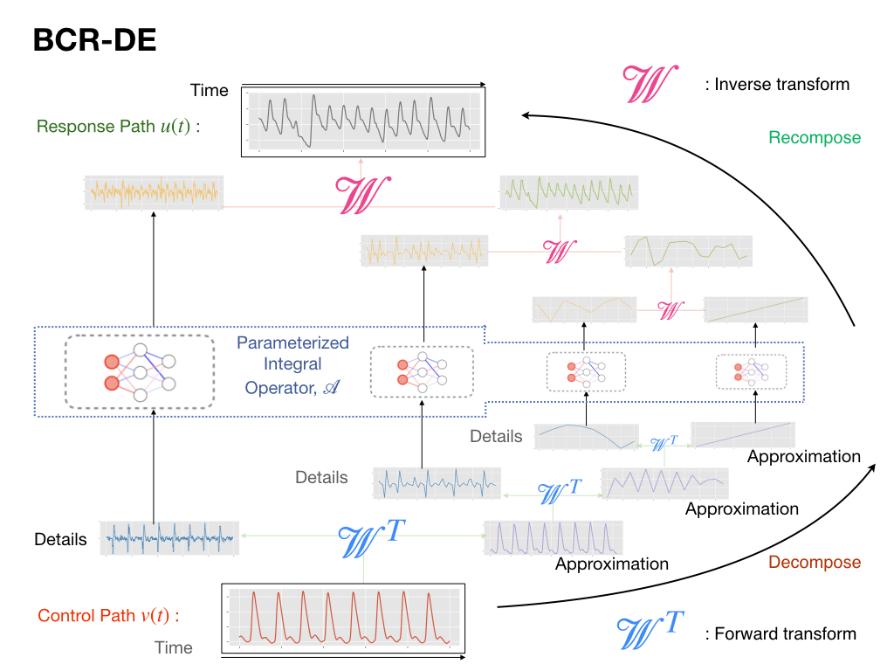

# Controlled Differential Equations on Long Sequences via Non-standard Wavelets (ICML 23)
[[Paper]](https://proceedings.mlr.press/v202/pal23b.html) [[Poster]](./asset/BCRDE_ICML_poster.pdf) [[Slide]](./asset/BCRDE_slide.pdf)

#### Sourav Pal, Zhanpeng Zeng, Sathya N. Ravi, Vikas Singh

# Framework



# Installation
The code is written to be compatible with Python3.6+ . We outlay steps to create the required environment and install dependencies, using Anaconda and pip. Please refer to their installations if you already don't have them.
```
conda create --name BCRDE python=3.9
```
Install dependencies using the provided requirement file.
```
pip install -r req.txt
```
Additionally, one needs to install the [Pytorch Wavelets](https://pytorch-wavelets.readthedocs.io/en/latest/index.html) library. We list the install instruction below:
```
git clone https://github.com/fbcotter/pytorch_wavelets
cd pytorch_wavelets
pip install .
```

# Code
All code resides in the folder BCR_DE, including model files, scripts to run the experiments in the paper as well as configuration files as and when required. Please check the corresponding [README](./BCR_DE/README.md) for instructions on running the experiments. We also include a notebook to demonstrate the non-standard wavelet decomposition.

We propose a variant of [locally connected convolution](https://keras.io/api/layers/locally_connected_layers/) in our paper termed as [Partially Unshared Convolution (PUC)](./BCR_DE/BCR_DE_model.py#L84) layer which helps in the paremeterization required for BCR-DE. We provide two implementations including one which is sufficiently faster to use via einops. Note that these classes are written using PyTorch and can be used as plug and play in relevant deep learning models, the code for which is present in the [BCR-DE model file](./BCR_DE/BCR_DE_model.py).

# Update
We have included a jax implementation for the model inside the folder [BCR_DE_JAX](https://github.com/sourav-roni/BCR-DE/tree/main/BCR_DE_JAX)

# Data
Please find the datasets used for experiments reported in the paper here [Google Drive](https://drive.google.com/file/d/1CFlnfC9CugfiAInKLHihjdJkyav6q80-/view?usp=sharing). These include data from [BIDMC32 dataset](https://arxiv.org/abs/2006.10996), [Eigenworm dataset](https://link.springer.com/article/10.1007/s10618-016-0483-9), and [TSER](http://tseregression.org/), we include it here for the ease of use. Please download the folder, unzip it and place it parallel to the BCR_DE folder. This will allow to use the code out of the box, else you will need to provide the specific paths to the data while running the experiments.

The data for the [Hodgkin–Huxley model](https://www.ncbi.nlm.nih.gov/pmc/articles/PMC1392413/) was generated using code from [pyHH](https://github.com/swharden/pyHH). We have included the sample data used in the experiments in the above data folder, since it takes quite some to generate.

# Citation
If you find our paper/code useful, please cite our [paper](https://openreview.net/pdf?id=bm2qVX0h09) at ICML 23

```
@InProceedings{pmlr-v202-pal23b,
  title = 	 {Controlled Differential Equations on Long Sequences via Non-standard Wavelets},
  author =       {Pal, Sourav and Zeng, Zhanpeng and Ravi, Sathya N. and Singh, Vikas},
  booktitle = 	 {Proceedings of the 40th International Conference on Machine Learning},
  pages = 	 {26820--26836},
  year = 	 {2023},
  volume = 	 {202},
  series = 	 {Proceedings of Machine Learning Research},
  publisher =    {PMLR},
}
```

Shield: [![CC BY-NC 4.0][cc-by-nc-shield]][cc-by-nc]

This work is licensed under a
[Creative Commons Attribution-NonCommercial 4.0 International License][cc-by-nc].

[![CC BY-NC 4.0][cc-by-nc-image]][cc-by-nc]

[cc-by-nc]: https://creativecommons.org/licenses/by-nc/4.0/
[cc-by-nc-image]: https://licensebuttons.net/l/by-nc/4.0/88x31.png
[cc-by-nc-shield]: https://img.shields.io/badge/License-CC%20BY--NC%204.0-lightgrey.svg
